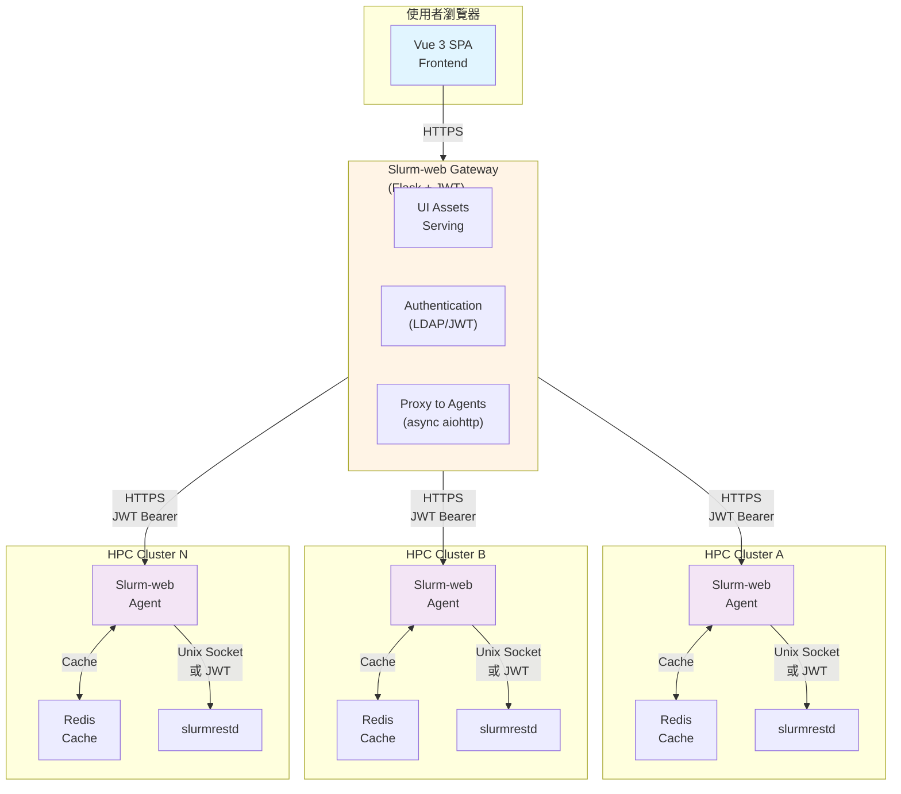
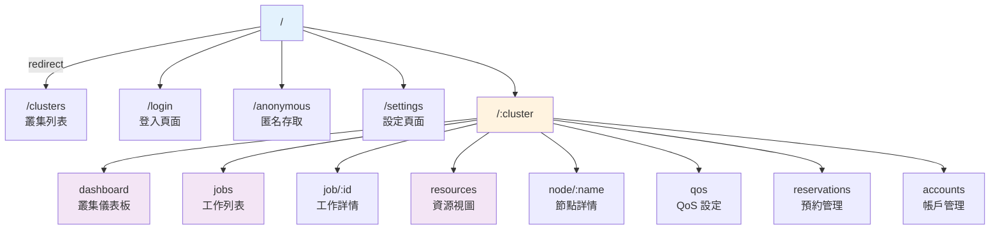
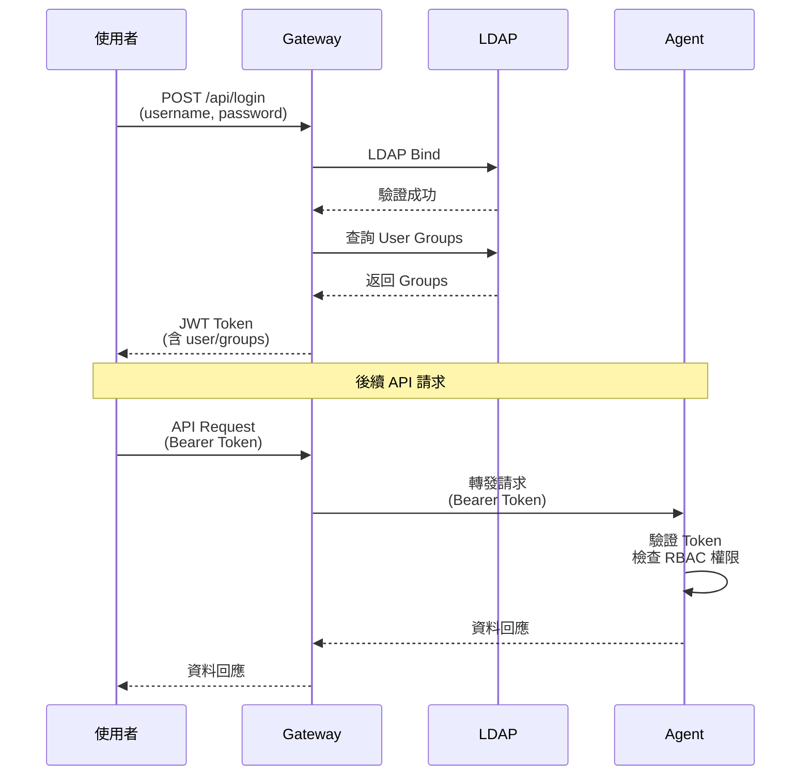
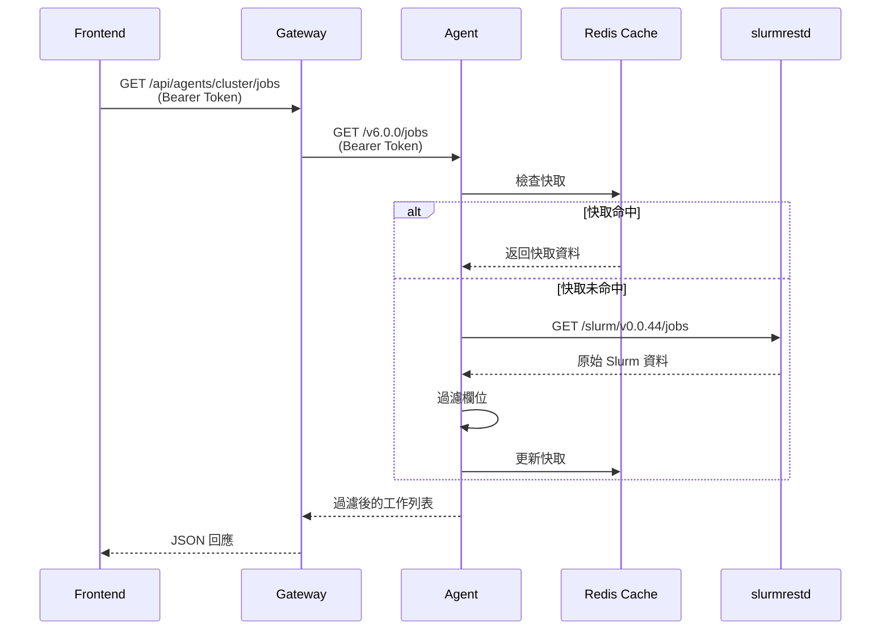
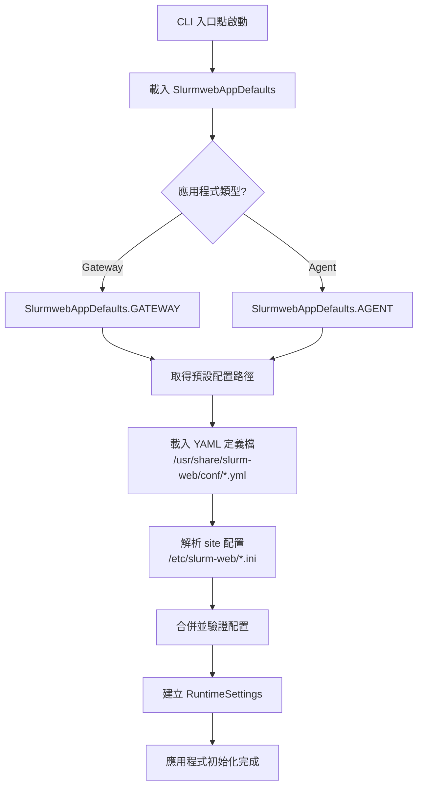

# Slurm-web 架構文件

## 系統架構概覽

Slurm-web 採用**前後端分離的多層架構**，由以下主要組件構成：



## 組件詳細說明

### 1. Frontend (Vue 3 SPA)

**位置**: `/frontend/`

Vue 3 單頁應用程式，使用 Composition API 和 TypeScript 開發。

#### 核心架構模式

- **State Management**: Pinia stores 用於全局狀態管理
- **Composables**: 可復用的邏輯封裝（`/src/composables/`）
- **Component Architecture**: 功能模組化的組件結構

#### 主要模組

| 模組 | 路徑 | 說明 |
|------|------|------|
| Views | `/src/views/` | 頁面級組件（17 個視圖） |
| Components | `/src/components/` | 可復用 UI 組件（50+ 組件） |
| Stores | `/src/stores/` | Pinia 狀態管理（auth, runtime） |
| Composables | `/src/composables/` | 業務邏輯封裝（10 個 composables） |
| Plugins | `/src/plugins/` | Vue 插件（http, runtimeConfiguration） |

#### 路由結構



---

### 2. Gateway (Flask Application)

**位置**: `/slurmweb/apps/gateway.py`

中央網關服務，負責：
- 提供前端靜態資源
- 使用者認證（LDAP + JWT）
- 代理請求到各叢集 Agent

#### 類別層次

```text
SlurmwebGenericApp
    │
    └── SlurmwebWebApp (Flask)
            │
            └── SlurmwebAppGateway (RFLTokenizedWebApp)
```

#### Gateway API 端點

| 端點 | 方法 | 說明 |
|------|------|------|
| `/api/version` | GET | 版本資訊 |
| `/api/login` | POST | 使用者登入 |
| `/api/anonymous` | GET | 匿名存取 |
| `/api/clusters` | GET | 叢集列表 |
| `/api/users` | GET | 使用者列表 |
| `/api/agents/<cluster>/*` | GET/POST | 代理到 Agent |

#### 認證流程



---

### 3. Agent (Flask Application)

**位置**: `/slurmweb/apps/agent.py`

部署於每個 HPC 叢集的服務，負責：
- 與本地 slurmrestd 通訊
- 快取 Slurm 資料（Redis）
- RBAC 權限控制
- 提供 RacksDB 整合（可選）

#### 類別層次

```text
SlurmwebGenericApp
    │
    └── SlurmwebWebApp (Flask)
            │
            └── SlurmwebAppAgent (RFLTokenizedRBACWebApp)
```

#### Agent API 端點

| 端點 | RBAC Action | 說明 |
|------|-------------|------|
| `/info` | - | Agent 資訊 |
| `/v{version}/permissions` | - | 使用者權限 |
| `/v{version}/ping` | - | Slurm 連線測試 |
| `/v{version}/stats` | view-stats | 統計摘要 |
| `/v{version}/jobs` | view-jobs | 工作列表 |
| `/v{version}/job/<id>` | view-jobs | 工作詳情 |
| `/v{version}/nodes` | view-nodes | 節點列表 |
| `/v{version}/node/<name>` | view-nodes | 節點詳情 |
| `/v{version}/partitions` | view-partitions | 分區列表 |
| `/v{version}/qos` | view-qos | QoS 列表 |
| `/v{version}/reservations` | view-reservations | 預約列表 |
| `/v{version}/accounts` | view-accounts | 帳戶列表 |
| `/v{version}/cache/stats` | cache-view | 快取統計 |
| `/v{version}/metrics/<type>` | view-* | Prometheus 指標 |

---

### 4. Slurmrestd Client

**位置**: `/slurmweb/slurmrestd/`

與 Slurm REST API 通訊的客戶端模組。

#### 模組結構

```text
slurmrestd/
├── __init__.py          # SlurmrestdFiltered, SlurmrestdFilteredCached
├── auth.py              # SlurmrestdAuthentifier (JWT/local)
├── errors.py            # 錯誤類別
├── unix.py              # Unix socket HTTP adapter
└── adapters/            # API 版本適配器
    ├── base.py          # 基礎適配器
    ├── v0_0_41.py
    ├── v0_0_42.py
    └── v0_0_43.py
```

#### 支援的 API 版本

- `0.0.44` (最新)
- `0.0.43`
- `0.0.42`
- `0.0.41`

自動版本發現：Agent 啟動時會自動偵測 slurmrestd 支援的 API 版本。

---

## 資料流程

### 取得工作列表流程



---

## 配置架構

### 配置檔案層次

```text
/usr/share/slurm-web/conf/  # Vendor 預設配置
├── gateway.yml              # Gateway 設定定義
├── agent.yml                # Agent 設定定義
└── policy.yml               # RBAC 政策定義

/etc/slurm-web/              # Site 自訂配置
├── gateway.ini              # Gateway 站點配置
├── agent.ini                # Agent 站點配置
└── policy.ini               # RBAC 角色配置
```

### 配置初始化流程



### 主要配置區塊

#### Gateway 配置

| 區塊 | 說明 |
|------|------|
| `service` | 服務綁定設定 |
| `ui` | 前端資源設定 |
| `agents` | Agent URL 列表 |
| `authentication` | 認證方式設定 |
| `ldap` | LDAP 連線設定 |
| `jwt` | JWT 簽章設定 |

#### Agent 配置

| 區塊 | 說明 |
|------|------|
| `service` | 服務與叢集名稱 |
| `slurmrestd` | slurmrestd 連線設定 |
| `filters` | API 欄位過濾 |
| `policy` | RBAC 政策路徑 |
| `jwt` | JWT 驗證設定 |
| `racksdb` | RacksDB 整合設定 |
| `cache` | Redis 快取設定 |
| `metrics` | Prometheus 設定 |

---

## 安全架構

### 認證 (Authentication)

- **LDAP**: 支援 ldap/ldaps/STARTTLS
- **JWT**: HS256/RS256/ES256 等多種演算法
- **Anonymous Mode**: 可選的匿名存取模式

### 授權 (Authorization)

採用 **Role-Based Access Control (RBAC)**：

```yaml
# policy.ini 範例
[user]
actions = view-stats, view-jobs, view-nodes

[admin]
actions = view-stats, view-jobs, view-nodes, cache-view, cache-reset
```

### 通訊安全

- Gateway ↔ Agent: HTTPS + JWT Bearer Token
- Agent ↔ slurmrestd: Unix Socket 或 JWT 認證
- Frontend ↔ Gateway: HTTPS + JWT

---

## 效能考量

### 快取策略 (Redis)

| 資料類型 | 預設 TTL |
|----------|----------|
| Slurm 版本 | 1800 秒 |
| Jobs 列表 | 30 秒 |
| 單一 Job | 10 秒 |
| Nodes 列表 | 30 秒 |
| Partitions | 60 秒 |
| QoS | 60 秒 |
| Reservations | 60 秒 |
| Accounts | 60 秒 |

### 欄位過濾

Agent 會過濾 slurmrestd 回傳的資料，只保留必要欄位，減少傳輸量和處理時間。

---

## 可選整合

### RacksDB 整合

提供機房設備視覺化功能：
- 機架佈局圖
- 節點位置對應
- 設備標籤顯示

### Prometheus 整合

提供歷史指標功能：
- 節點狀態歷史
- CPU/GPU 使用率趨勢
- 工作統計圖表
- 快取效能指標

---

*此文件由 BMAD Document Project Workflow 自動生成*
