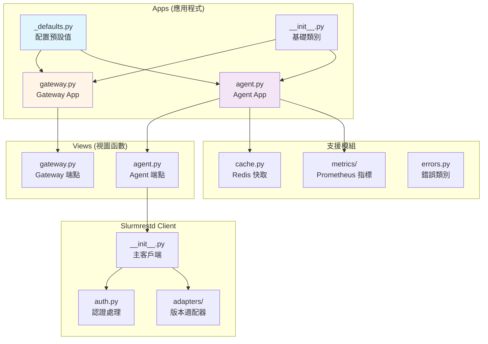
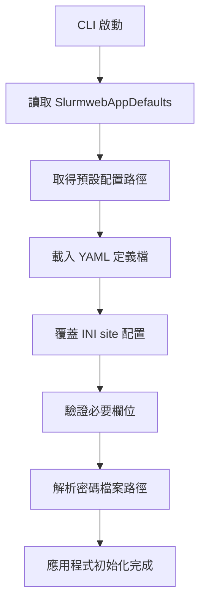

# Slurm-web 後端文件

## 概述

Slurm-web 後端由兩個主要的 Flask 應用程式組成：**Gateway** 和 **Agent**。

## 技術堆疊

| 類別 | 技術 |
|------|------|
| Framework | Flask |
| Language | Python 3.6+ |
| Async HTTP | aiohttp |
| Authentication | RFL.authentication (LDAP) |
| JWT | PyJWT |
| Caching | Redis |
| Metrics | prometheus-client |
| Configuration | RFL.settings |

## 專案結構

```text
slurmweb/
├── __init__.py
├── version.py               # 版本資訊
├── errors.py                # 自定義例外
├── cache.py                 # Redis 快取服務
├── markdown.py              # Markdown 渲染
├── ui.py                    # UI 資源處理
├── apps/                    # Flask 應用程式
│   ├── __init__.py          # 基礎類別
│   ├── _defaults.py         # 配置預設值（集中管理）
│   ├── gateway.py           # Gateway 應用程式
│   ├── agent.py             # Agent 應用程式
│   ├── connect.py           # 連線測試工具
│   ├── genjwt.py            # JWT 產生工具
│   ├── ldap.py              # LDAP 測試工具
│   └── showconf.py          # 配置顯示工具
├── views/                   # API 視圖函數
│   ├── __init__.py          # SlurmwebAppRoute
│   ├── gateway.py           # Gateway 端點
│   └── agent.py             # Agent 端點
├── slurmrestd/              # Slurm REST API 客戶端
│   ├── __init__.py          # 主要客戶端類別
│   ├── auth.py              # 認證處理
│   ├── errors.py            # 錯誤類別
│   ├── unix.py              # Unix socket 適配器
│   └── adapters/            # API 版本適配器
├── metrics/                 # Prometheus 指標
│   ├── __init__.py
│   ├── collector.py         # 指標收集器
│   └── db.py                # 指標資料庫查詢
├── exec/                    # CLI 入口點
│   ├── __init__.py
│   ├── main.py              # 主 CLI
│   ├── gateway.py           # slurm-web-gateway
│   ├── agent.py             # slurm-web-agent
│   ├── connect.py           # slurm-web-connect
│   ├── genjwt.py            # slurm-web-genjwt
│   ├── ldap.py              # slurm-web-ldap
│   └── showconf.py          # slurm-web-showconf
└── tests/                   # 單元測試
```

---

## 核心模組



### 1. Apps（應用程式）

#### 配置預設值 (`/apps/_defaults.py`)

集中式配置管理模組，所有應用程式的預設配置路徑統一在此定義。

```python
class SlurmwebAppDefaultsSettings:
    """配置預設值容器"""
    def __init__(self, site_configuration: str, settings_definition: str):
        self.site_configuration = site_configuration  # INI 配置檔路徑
        self.settings_definition = settings_definition  # YAML 定義檔路徑

class SlurmwebAppDefaults:
    """應用程式配置預設值"""
    GATEWAY = SlurmwebAppDefaultsSettings(
        site_configuration="/etc/slurm-web/gateway.ini",
        settings_definition="/usr/share/slurm-web/conf/gateway.yml",
    )
    AGENT = SlurmwebAppDefaultsSettings(
        site_configuration="/etc/slurm-web/agent.ini",
        settings_definition="/usr/share/slurm-web/conf/agent.yml",
    )
```

#### 基礎類別 (`/apps/__init__.py`)

```python
class SlurmwebAppSeed:
    """應用程式初始化參數容器"""
    @classmethod
    def with_parameters(cls, **kwargs): ...

class SlurmwebGenericApp:
    """基礎應用程式類別"""
    NAME = None

    def __init__(self, seed: SlurmwebAppSeed): ...
    def run(self): ...

class SlurmwebWebApp(SlurmwebGenericApp, Flask):
    """Flask Web 應用程式基礎類別"""
    VIEWS = set()

    def __init__(self, seed: SlurmwebAppSeed): ...
    def _handle_bad_request(self, error): ...
    def set_templates_folder(self, path: Path): ...
    def run(self): ...
```

#### Gateway (`/apps/gateway.py`)

```python
class SlurmwebAppGateway(SlurmwebWebApp, RFLTokenizedWebApp):
    """
    中央網關應用程式

    職責：
    - 提供前端靜態資源
    - 使用者認證（LDAP + JWT）
    - 代理請求到各叢集 Agent
    """
    NAME = "slurm-web gateway"

    VIEWS = {
        SlurmwebAppRoute("/api/version", views.version),
        SlurmwebAppRoute("/api/login", views.login, methods=["POST"]),
        SlurmwebAppRoute("/api/anonymous", views.anonymous),
        SlurmwebAppRoute("/api/clusters", views.clusters),
        SlurmwebAppRoute("/api/users", views.users),
        SlurmwebAppRoute("/api/agents/<cluster>/jobs", views.jobs),
        # ... 更多路由
    }

    @property
    def agents(self):
        """取得所有 Agent 資訊（含快取）"""

    async def _get_agents_info(self):
        """非同步取得所有 Agent 資訊"""
```

#### Agent (`/apps/agent.py`)

```python
class SlurmwebAppAgent(SlurmwebWebApp, RFLTokenizedRBACWebApp):
    """
    叢集代理應用程式

    職責：
    - 與本地 slurmrestd 通訊
    - 快取 Slurm 資料
    - RBAC 權限控制
    - RacksDB 整合
    """
    NAME = "slurm-web agent"

    VIEWS = {
        SlurmwebAppRoute("/info", views.info),
        SlurmwebAppRoute(f"/v{get_version()}/permissions", views.permissions),
        SlurmwebAppRoute(f"/v{get_version()}/jobs", views.jobs),
        # ... 更多路由
    }
```

---

### 2. Slurmrestd Client (`/slurmrestd/`)

#### 主要類別

```python
class Slurmrestd:
    """基礎 slurmrestd 客戶端"""
    def __init__(self, uri: urllib.parse.ParseResult, auth: SlurmrestdAuthentifier): ...
    def request(self, query: str) -> dict: ...
    def discover(self) -> Tuple[str, str, str]: ...

class SlurmrestdFiltered(Slurmrestd):
    """帶欄位過濾的客戶端"""
    def __init__(self, uri, auth, versions, filters): ...
    def jobs(self) -> List[dict]: ...
    def job(self, job_id: int) -> dict: ...
    def nodes(self) -> List[dict]: ...
    def node(self, name: str) -> dict: ...
    # ...

class SlurmrestdFilteredCached(SlurmrestdFiltered):
    """帶快取的客戶端"""
    def __init__(self, uri, auth, versions, filters, cache_settings, cache_service): ...
```

#### 認證 (`/slurmrestd/auth.py`)

```python
class SlurmrestdAuthentifier:
    """slurmrestd 認證處理器"""

    def __init__(
        self,
        method: str,          # "jwt" 或 "local"
        jwt_mode: str,        # "auto" 或 "static"
        jwt_user: str,
        jwt_key: Path,
        jwt_lifespan: int,
        jwt_token: str
    ): ...

    @property
    def headers(self) -> dict:
        """產生認證 HTTP headers"""
```

#### 版本適配器 (`/slurmrestd/adapters/`)

處理不同 slurmrestd API 版本的差異：

```python
class SlurmrestdAdapter:
    """基礎適配器"""
    VERSION = None

    @staticmethod
    def filter_job(job: dict, filters: list) -> dict: ...
    @staticmethod
    def filter_node(node: dict, filters: list) -> dict: ...
    # ...

class SlurmrestdAdapterV0_0_41(SlurmrestdAdapter):
    VERSION = "0.0.41"

class SlurmrestdAdapterV0_0_42(SlurmrestdAdapterV0_0_41):
    VERSION = "0.0.42"

class SlurmrestdAdapterV0_0_43(SlurmrestdAdapterV0_0_42):
    VERSION = "0.0.43"
```

---

### 3. Cache Service (`/cache.py`)

```python
class CachingService:
    """Redis 快取服務"""

    def __init__(self, host: str, port: int, password: str = None): ...

    def get(self, key: str) -> Optional[Any]:
        """取得快取值"""

    def set(self, key: str, value: Any, ttl: int):
        """設定快取值"""

    def metrics(self) -> Tuple[dict, dict, int, int]:
        """取得快取指標"""

    def reset(self):
        """重設快取"""
```

---

### 4. Metrics (`/metrics/`)

#### Collector (`/metrics/collector.py`)

```python
class SlurmWebMetricsCollector:
    """Prometheus 指標收集器"""

    def __init__(self, slurmrestd: Slurmrestd, cache: CachingService): ...

    def collect(self):
        """收集並產生 Prometheus 指標"""
        # - slurm_nodes (gauge)
        # - slurm_cores (gauge)
        # - slurm_gpus (gauge)
        # - slurm_jobs (gauge)
        # - slurm_cache (counter)
```

#### DB Query (`/metrics/db.py`)

```python
class SlurmwebMetricsDB:
    """Prometheus 資料庫查詢"""

    def __init__(self, host: str, job: str): ...

    def request(self, metric: str, range: str) -> dict:
        """查詢歷史指標"""
```

---

### 5. Views（視圖函數）

#### Gateway Views (`/views/gateway.py`)

| 函數 | 裝飾器 | 說明 |
|------|--------|------|
| `version()` | - | 版本資訊 |
| `login()` | - | 使用者登入 |
| `anonymous()` | - | 匿名存取 |
| `message_login()` | - | 登入訊息 |
| `clusters()` | `@check_jwt` | 叢集列表 |
| `users()` | `@check_jwt` | 使用者列表 |
| `ping(cluster)` | `@check_jwt`, `@validate_cluster` | Ping Agent |
| `stats(cluster)` | `@check_jwt`, `@validate_cluster` | 統計資料 |
| `jobs(cluster)` | `@check_jwt`, `@validate_cluster` | 工作列表 |
| `job(cluster, job)` | `@check_jwt`, `@validate_cluster` | 工作詳情 |
| `nodes(cluster)` | `@check_jwt`, `@validate_cluster` | 節點列表 |
| `node(cluster, name)` | `@check_jwt`, `@validate_cluster` | 節點詳情 |

#### Agent Views (`/views/agent.py`)

| 函數 | RBAC Action | 說明 |
|------|-------------|------|
| `version()` | - | 版本資訊 |
| `info()` | - | Agent 資訊 |
| `permissions()` | - | 使用者權限 |
| `ping()` | - | Slurm 連線測試 |
| `stats()` | `view-stats` | 統計摘要 |
| `jobs()` | `view-jobs` | 工作列表 |
| `job(job)` | `view-jobs` | 工作詳情 |
| `nodes()` | `view-nodes` | 節點列表 |
| `node(name)` | `view-nodes` | 節點詳情 |
| `partitions()` | `view-partitions` | 分區列表 |
| `qos()` | `view-qos` | QoS 列表 |
| `reservations()` | `view-reservations` | 預約列表 |
| `accounts()` | `view-accounts` | 帳戶列表 |
| `associations()` | `associations-view` | 關聯列表 |
| `cache_stats()` | `cache-view` | 快取統計 |
| `cache_reset()` | `cache-reset` | 重設快取 |
| `metrics(metric)` | 動態 | Prometheus 指標 |

---

### 6. CLI 入口點 (`/exec/`)

| 命令 | 說明 |
|------|------|
| `slurm-web-gateway` | 啟動 Gateway 服務 |
| `slurm-web-agent` | 啟動 Agent 服務 |
| `slurm-web-connect` | 測試 slurmrestd 連線 |
| `slurm-web-genjwt` | 產生 JWT Token |
| `slurm-web-ldap` | 測試 LDAP 認證 |
| `slurm-web-showconf` | 顯示配置 |

#### CLI 配置載入機制

CLI 入口點使用 `SlurmwebAppDefaults` 載入配置預設值：

```python
# slurmweb/exec/gateway.py
from ..apps._defaults import SlurmwebAppDefaults

parser.add_argument(
    "--conf-defs",
    help="Path to configuration settings definition file (default: %(default)s)",
    default=SlurmwebAppDefaults.GATEWAY.settings_definition,
    type=Path,
)
parser.add_argument(
    "--conf",
    help="Path to configuration file (default: %(default)s)",
    default=SlurmwebAppDefaults.GATEWAY.site_configuration,
    type=Path,
)
```

---

## 配置系統

### 配置定義格式 (YAML)

```yaml
service:
  interface:
    type: str
    default: localhost
    doc: Address of network interfaces to bind
  port:
    type: int
    default: 5011
    doc: TCP port to listen
  cors:
    type: bool
    default: false
    doc: Enable CORS headers
```

### 配置載入流程



---

## 錯誤處理

### 自定義例外 (`/errors.py`)

```python
class SlurmwebConfigurationError(Exception):
    """配置錯誤"""

class SlurmwebAgentError(Exception):
    """Agent 通訊錯誤"""

class SlurmwebCacheError(Exception):
    """快取錯誤"""

class SlurmwebMetricsDBError(Exception):
    """指標資料庫錯誤"""
```

### Slurmrestd 例外 (`/slurmrestd/errors.py`)

```python
class SlurmrestConnectionError(Exception):
    """連線錯誤"""

class SlurmrestdNotFoundError(Exception):
    """資源不存在"""

class SlurmrestdInvalidResponseError(Exception):
    """回應格式錯誤"""

class SlurmrestdAuthenticationError(Exception):
    """認證錯誤"""

class SlurmrestdInternalError(Exception):
    """slurmrestd 內部錯誤"""
```

---

## 測試

### 測試結構

```
tests/
├── lib/                     # 測試輔助工具
│   ├── slurmrestd.py        # Mock slurmrestd
│   ├── gateway.py           # Gateway 測試客戶端
│   └── agent.py             # Agent 測試客戶端
├── apps/                    # 應用程式測試
├── views/                   # 視圖測試
├── slurmrestd/              # Slurmrestd 客戶端測試
├── metrics/                 # 指標測試
└── exec/                    # CLI 測試
```

### 執行測試

```bash
# 使用 pytest
pytest slurmweb/tests/

# 帶覆蓋率
pytest --cov=slurmweb slurmweb/tests/
```

---

## 開發

### 安裝開發依賴

```bash
pip install -e ".[dev]"
```

### 本地執行

```bash
# Gateway
slurm-web-gateway --debug --conf /path/to/gateway.ini

# Agent
slurm-web-agent --debug --conf /path/to/agent.ini
```

### 型別檢查

```bash
mypy slurmweb/
```

### 格式化

```bash
black slurmweb/
isort slurmweb/
```

---

*此文件由 BMAD Document Project Workflow 自動生成*
